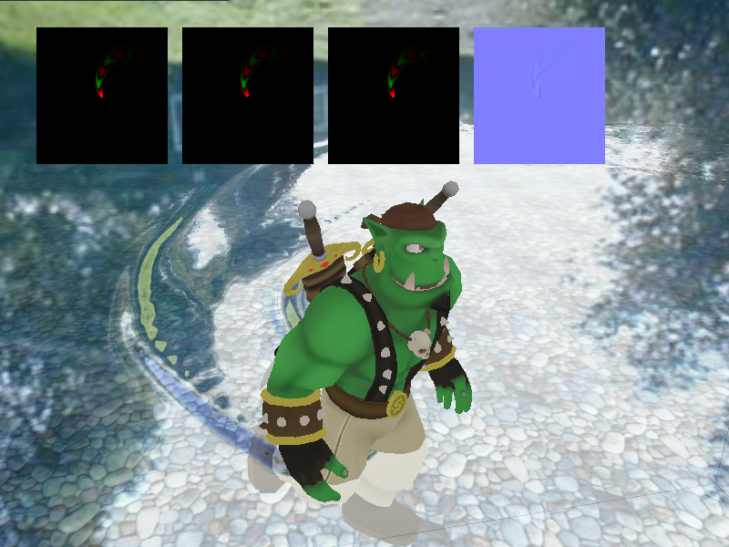

Dynamic water ripple effect in Ogre3D/GLSL, based on demo http://cmlab.csie.ntu.edu.tw/~perng/3D/

Implementation
==============

The propagation of ripples is implemented on the GPU. A heightmap stores the current state of the simulation. The shader program "WaterSim.glfs" then simulates one frame by "smoothing out" the height map. Because it is not possible to write to the texture that the shader is currently reading from, a series of textures are used that "ping-pong" their results between each other.

When the player moves around, the origin of the simulation is shifted, hence allowing them to move whereever they want even though the range of the simulation is limited. (If you move too fast, you might notice water waves behind you getting cut off at some point)

Build dependencies
==================

* Ogre3D 1.9
* OIS
* boost system (not actually used, but required by Ogre)
